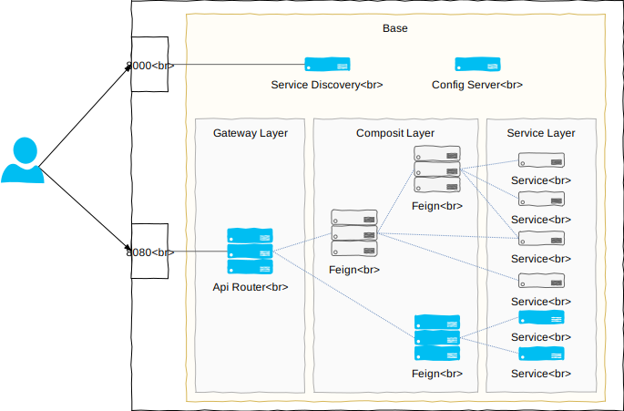

## 從 Spring Cloud 開始的 Microservice

> 帶領大家了解 Spring Cloud 是如何把每一個 Spring Boot App 透過 Feign、Eureka 串聯起來

[http://bit.ly/jcconf2018-spring-cloud](http://bit.ly/jcconf2018-spring-cloud)


### Requirements

- Some knowledge of Spring Framework (preferably Sprign Boot)
- Some basic knowledge of docker (run, trace logs of container, etc..)

### What Will I Learn?

- 在 45 分鐘內了解如何使用 Spring Cloud 實作微服務


## Getting Started

### Prerequisites

執行環境必須已安裝好以下軟體:

- Docker - 請從 [Docker Store](https://store.docker.com/search?offering=community&type=edition) 選擇適合的版本下載安裝, 或執行以下指令自動安裝最新版本: 
    ```
    $ curl -fsSL https://get.docker.com/ | sh
    ```
	
- Docker Compose - 如果你是安裝 Docker for Windows 或是 Docker for Mac 則已經內涵 Compose, 如果是 Linux 請參考 [
Install Compose on Linux systems](https://docs.docker.com/compose/install/#install-compose)

### Build

將此 repository clone 到本機後, 本篇的所有指令都是在 repository 的根目錄執行:

```sh
. <在這執行>
├── README.md
├── docker-compose.yml
├── jcconf2018-config/
├── jcconf2018-eureka/
├── ...
└── ...


# 打包 source 成 docker image
$ docker-compose build
```

### Starting the application

```sh
$ docker-compose up -d

# scale up service to 2 cluster
$ docker-compose up -d --scale service=2
```

### Testing Api

```sh
# eureka console http://localhost:8000/

# call
$ curl http://localhost:8080/feign/common/echoip/service

# call with loadbalance(ribbon)
$ curl http://localhost:8080/lb/feign/common/echoip/service

# direct call
$ curl http://localhost:8080/service/echoip

```

## Overview
### Modules


> 本次介紹僅針對藍色的部分
- jcconf2018-config
    - Features: Config Server
    - Port: 8888:8888
    - `config-server`
- jcconf2018-eureka
    - Features: Service Discovery
    - Port: 8000:8000
    - `eureka-server`, `config-client`
- jcconf2018-gateway
    - Features: Api Router
    - Port: 8080:80
    - `eureka-client`, `config-client`, `gateway`
- jcconf2018-feign
    - Features: Composite Service
    - Port: :80
    - `eureka-client`, `config-client`, `web`, `feign`
- jcconf2018-service
    - Features: Base Service(Web App)
    - Port: :80
    - `eureka-client`, `config-client`, `web`
> 本次的服務皆啟在 docker 上，因此 Port 描述上，`:`左邊表公開Port、右邊為DockerNetwork Port

### Flow


1. 啟動
    1. `ConfigServer` 啟動
        > 由於有設定 `spring.cloud.config.failFast=true` 的緣故, 其餘服務在 Config Server 可以開始提供服務前, 會啟動失敗, 並嘗試重啟到獲得 Config 為止
    2. `Eureka` 啟動
    3. `CompositeService`, `BaseService` 啟動, 並嘗試向 `Eureka` 註冊 ServiceName
2. 回應請求
    1. 由 `Gateway` 接收所有的 request, 並根據 router 規則轉導到相對應的服務上
    2. 若轉到對向為內部服務, 則 `Eureka` 會根據呼叫的 ServiceName 提供服務的 IP
    3. `Gateway` 獲取 IP 後呼叫服務

### Common Configs
- Config Server 相關
    - 啟動 App 後的第一個步驟是先到 Config Server 取得相對應的設定
    - 除了 Config Server 外的服務都需要進行此設定
    - 此類設定置於各 App 下的 `bootstrap.properties`
    ```properties
    # AppName 同時也用作於 Config Server 的 ConfigName
    spring.application.name=service

    # ConfigServer 連線, 與嘗試連線次數的相關設定
    spring.cloud.config.uri=http://config:8888
    spring.cloud.config.retry.maxAttempts=1    #嘗試與ConfigServer連線的次數
    spring.cloud.config.failFast=true          #由於App的啟動管理已經交給docker, 這邊若嘗試失敗則直接停掉App即可
    spring.cloud.config.label=master           #ConfigServer是以git的結構儲存config, 此處的label即為git label
    ```
- Eureka Client 相關
    - 屬於會被其他功能呼叫的服務, 需要註冊到 Eureka 作為 Eureka Client 運行
    - `service`, `feign` 需要進行此設定
    - 根據是否是共通設定, 置於 Config Server 的 `application.properties` 或 `{AppName}.properties`
    ```properties
    # 啟動作為 Eureka Client 的功能
    eureka.client.enable=true

    # eureka 服務位置
    eureka.client.serviceUrl.defaultZone=http://eureka:8000/eureka/

    # eureka 相關更新週期設定
    # 為了 demo 能快速反應, 此處縮短了註冊, 更新, 過期的時間
    eureka.client.instance-info-replication-interval-seconds=10
    eureka.client.registry-fetch-interval-seconds=10
    eureka.instance.lease-renewal-interval-in-seconds=10
    eureka.instance.lease-expiration-duration-in-seconds=30

    # 當 ribbon 指向的 service 其中一個 server 失去連線時, 以其他 server 進行重試
    spring.cloud.loadbalancer.retry.enabled=true
    ```

## Detail
1. Service layer: [Service](./jcconf2018-service/README.md)
2. Composit layer: [Feign](./jcconf2018-feign/README.md)
3. Config server: [Config](./jcconf2018-config/README.md)
4. Service discovery: [Eureka](./jcconf2018-eureka/README.md)
5. Gateway layer: [Gateway](./jcconf2018-gateway/README.md)
