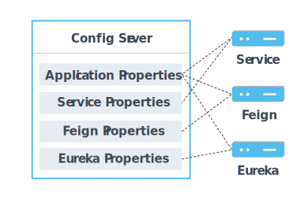

# Config Server


- 將設定檔進行集中管理
- 使用 git 進行管理, 可以更方便處理各版本的設定檔

## Setup
### dependency
- `spring-cloud-config-server`: 能作為 config server 自動產生提供設定檔的 API

### self config
```properties
# 指定 git reposity 位置
spring.cloud.config.server.git.uri=file:/config
# 指定預設讀取的 git label
spring.cloud.config.server.git.default-label=master
```

### config files
- `./config/`
    - spring config server 是利用 git 進行 config 管理
    - 為了方便起一個docker的獨立環境, 我們這邊不使用外部 git server, 而是在 docker 內部 init git server
    - 此資料夾即是 base
        > git init 會於啟動時透過 ./entrypoint.sh 執行(Dockerfile的設定)

- `./config/application.properties`
    - `application` 是 `spring.application.name` 的預設名稱
    - 此檔案同時也是所有 app 都會讀取的共通設定檔

- `./config/{spring.application.name}.properties`
    - spring boot app 在向 config server 取得設定檔時會根據自己的 `spring.application.name` 來取得相對應設定檔

- `./config/{spring.application.name}-{profile}.properties`
    - 與 SpringApp 原本的設定檔相同，此處同樣可以用 `-{profile}` 來處理各種不同運行情境的設定檔

- 權重順序如下
    1. `{spring.application.name}-{profile}.properties`
    2. `{spring.application.name}.properties`
    3. `application.properties`

#### p.s.
> 非Unix系的作業系統(例:windows), 須注意 `entrypoint.sh` 此檔案內的換行字符會於 clone 時被 git 變更, 導致以 docker 啟動時, 沒辦法正常運行 shell 的問題, 需要人工修改之, 或於 git 下命令進行設定後再行 clone
```sh
# http://jaybeka.github.io/2016/09/27/git-line-endings/
$ git config --global core.autocrlf input
```

[back](../README.md#detail)
