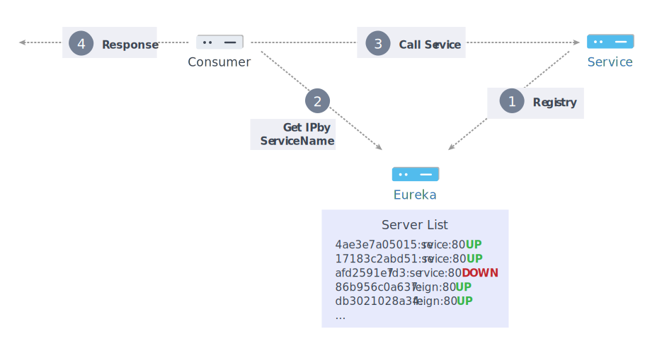

# Eureka


- 用於服務註冊, 與服務伺服清單的同步

## Setup
### dependency
- `spring-cloud-starter-netflix-eureka-server`: 提供 Eureka Server 的服務
- `spring-boot-starter-actuator`: 客製化 HealthCheck
- `spring-cloud-starter-config`: 能至 ConfigServer 取得設定檔

## Run
### Flow
1. `EurekaServer` 啟動
2. `EurekaClient` 向 `EurekaServer` 註冊, 並提供相關系統資訊
    - 如: host, port, 健康狀態查詢url...等
3. 將 `client` 納入伺服列表中
4. 其他 `client` 會定期到 `server` 取得伺服列表, 這個伺服列表會被 Ribbon 所使用
    - 天生具有 Ribbon 功能的服務: `Gateway`, `Feign`
5. `server` 根據週期設定, 定期向 `client` 發出心跳訊息(heartbeat message)
6. 若心跳訊息超過設定的時間沒有回應, 則將 `client` 從伺服列表中移除

### Server list
- 為了方便觀看更細節的註冊資訊, demo 客製了一個 controller 輸出目前的伺服列表
```sh
$ curl http://localhost:8000/registry
```

[back](../README.md#detail)
