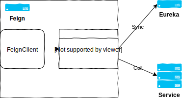

# Feign
- 提供組合服務(Composit Service), 相較於基礎服務(Base Service)提供更完整的商業邏輯
- 通常以串聯基礎服務來完成其功能, 串聯的方式透過 Feign 這一個 Dependency
- 以 WebApp 的架構為主, 提供 Restful API

## Setup
### dependency
- `spring-cloud-starter-openfeign`: 以類似 Web Service Stub 的方式, 將 RestfulApi 包裝成容易呼叫的介面
- `spring-boot-starter-web`: 以 Restful 的形式提供 API
- `spring-boot-starter-actuator`: 客製化 HealthCheck
- `spring-cloud-starter-config`: 能至 ConfigServer 取得設定檔
- `spring-cloud-starter-netflix-eureka-client`: 註冊到 EurekaServer 並提供服務

### FeignClient
- `tw.com.softleader.jcconf2018.feign.stub.SampleStub`
    ```java
    @FeignClient("service")
    public interface SampleStub {

        @RequestMapping(value = "/sample/echoip", method = RequestMethod.GET)
        ResponseEntity<String> echoip();

    }
    ```
- 為一 `Interface`, 與 Spring-JPA 的概念雷同, App 啟動後會由 Spring 進行實作
- 宣告 `@FeignClient`, 並於 value 宣告 serviceName(spring.application.name)
- 像是寫 Controller 一樣撰寫 Method, 但須注意只能用 `@RequestMapping` 而不能用 `@GetMapping`, `@PostMapping`...等
- 呼叫時, 直接 `@Autowired` 後當作一般的 SpringBean 使用即可
    ```java
    @Autowired private SampleStub sampleStub;

    public void run() {
        sampleStub.echoip();
    }
    ```

## How it works


1. 作為一個 EurekaClient, 會以一定頻率與 EurekaServer 同步可呼叫的 Server 清單
2. Server 清單會由 `Ribbon` 這個 Dependency 控管
    - `Ribbon` 是一個 client-side load balancer, 預設情況下 `FeignClient` 會使用其來呼叫外部 API
    - 與 `Eureka` 一樣是屬於 Netflix 的一個專案
3. 呼叫 `FeignClient` 時, 就會透過 load balance 機制呼叫 service 的其中一台 server 獲取回應
    - 預設情況下的 load balacne 是同一個 service 下的 server 輪流呼叫

[back](../README.md#detail)
