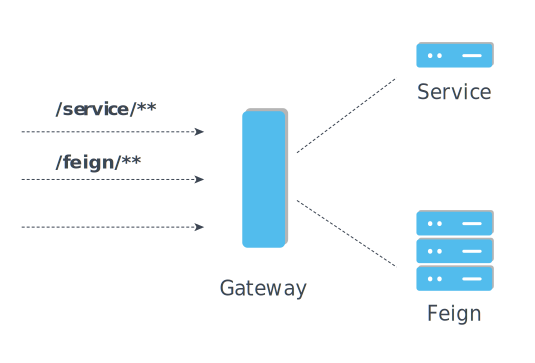
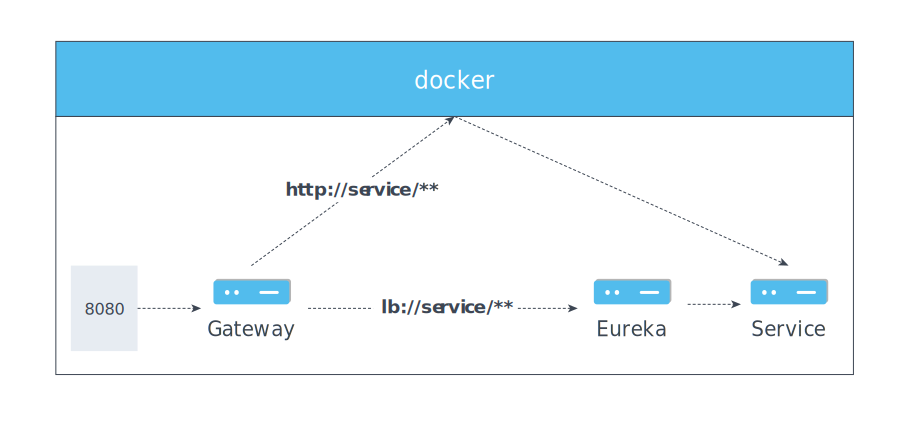

# Gateway


- 用於處理服務指向(Router)

## Setup
### dependency
- `spring-cloud-starter-gateway`: 提供做為 Gateway 的功能
- `spring-boot-starter-actuator`: 客製化 HealthCheck
- `spring-cloud-starter-config`: 能至 ConfigServer 取得設定檔
- `spring-cloud-starter-netflix-eureka-client`: 註冊到 EurekaServer 並提供服務

### Routers
```java
@Bean
public RouteLocator customRouteLocator(RouteLocatorBuilder builder) {
    return builder.routes()
            .route(r -> r
                    .path("/feign/**")
                    .filters(gatewayFilterSpec -> gatewayFilterSpec.rewritePath("/feign/(?<segment>.*)", "/${segment}"))
                    .uri("http://feign")
            )
            .route(r -> r
                    .path("/lb/feign/**")
                    .filters(gatewayFilterSpec -> gatewayFilterSpec.rewritePath("/lb/feign/(?<segment>.*)", "/${segment}"))
                    .uri("lb://feign")
            )
            .route(r -> r
                    .path("/service/echoip")
                    .uri("http://service/sample/echoip")
            )
            .route(r -> r
                    .path("/service/**")
                    .filters(gatewayFilterSpec -> gatewayFilterSpec.rewritePath("/service/(?<segment>.*)", "/${segment}"))
                    .uri("http://service")
            )
            .build();
}
```
- 向 Spring 註冊 RouteLocator, 引入 RouteLocatorBuilder 可以快速地進行 rouder 設定
- 針對每一個 route:
    - 定義 path: 來源 uri
    - 定義 uri: 要轉出去的 uri
    - 定義 filters: 對 request 進行加工
        - 例: gatewayFilterSpec.rewritePath 可以進行網址的重新 mapping
- 轉出 uri
    

    - 支援 http 與 tcp 協定
    - 啟用 Ribbon 的情況下, 可使用 lb 作為服務轉導
        - Ribbon 的伺服列表是來自 EurekaServer, 因此若要使用其 Service discovery 功能, 必須要選擇此方式
    - 使用 http 與 tcp 時, 在 docker network 內部可以直接轉導, 但會繞過 Eureka, 正常服務不應走這條路

[back](../README.md#detail)
